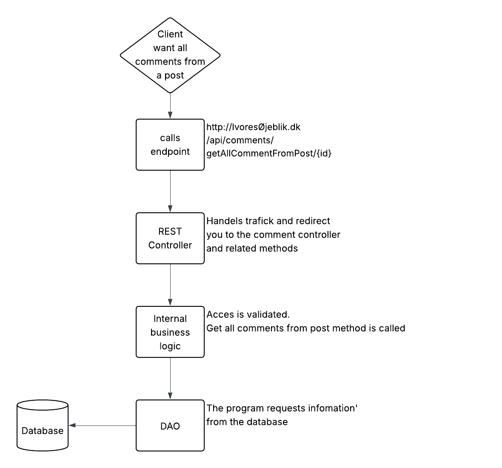
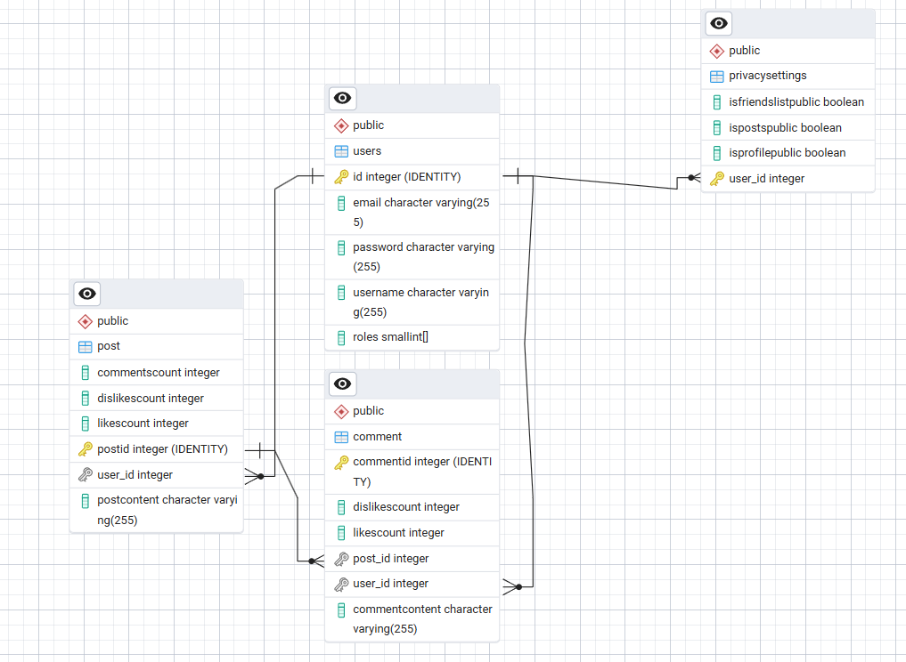

# Vores Øjeblik

## Vision

Having grown up during the early 2000s, I experienced what many consider the “golden age” of social media—platforms
that primarily focused on sharing personal moments, connecting with friends,
and fostering positive interactions.

In contrast, modern social media platforms have increasingly become dominated
by advertisements, political content, and algorithm-driven engagement,
often promoting conflict, negativity, and distraction rather than meaningful connection.

This project aims to address this shift by developing a more personal and
community-focused social media platform tailored specifically for users
in Denmark. The goal is to create an environment centered around local,
relevant content and genuine social interaction, rather than global trends
and click-driven content.

Example:
> Users can share posts with friends and family
> 
> Users can like, dislike, and comment on posts
> 
> Privacy settings allow users to control whether content is public or limited to friends
>
> Users can add friends to build a personal network and stay connected

---

## Links

Portfolio website:  
https://freddyboi123.github.io/Portfolio/

Project overview video (max 5 min):  
<LINK>

Deployed application (optional):  
<LINK>

Source code repository:  
https://github.com/Freddyboi123/Vores

---

# Architecture

## System Overview

This project is segmented into multiple different layers.

- **Controller Layer:** Handles incoming HTTP requests and exposes RESTful endpoints using Javalin.


- **Service Layer:**
  Contains the core business logic and coordinates data flow between 
controllers and the data access layer.


- **DAO Layer (Data Access Object):**
  Responsible for database interactions using JPA/Hibernate,
including queries and persistence operations.

- **Entity Layer:**
Defines the domain models as POJOs annotated as JPA entities, representing database tables.


- **Configuration Layer:**
Manages application configuration such as database connections, security setup, and JWT authentication.


- **Utility / Development Tools:**
Includes helper classes, debugging tools, or scripts used during development.

Technologies used:

- **Java** – Core programming language
- **Javalin** – Lightweight web framework for REST APIs
- **JPA / Hibernate** – ORM framework for database interaction
- **PostgreSQL** – Relational database
- **Maven** – Dependency and build management
- **JWT** (JSON Web Tokens) – Authentication and authorization
- **Docker** – Containerization for deployment
- **Ubuntu** – Development and deployment environment

---

## Architecture Diagram



### request lifecycle
The following describes the typical lifecycle of a request within the system.
Each operation is divided into clearly defined layers to ensure a structured,
maintainable, and scalable architecture.

Client Request
A client sends an HTTP request to the application (e.g., creating a post or retrieving data).
Controller Layer

The request is received by a REST endpoint, which validates input and forwards the request to the service layer.
Service Layer

The service layer processes the request by applying business logic and coordinating necessary operations.
DAO Layer

The DAO layer handles database interaction through JPA/Hibernate, performing queries or persistence operations.
Database

Data is stored, retrieved, or updated in the PostgreSQL database.
Response Flow

The result is returned from the DAO layer to the service layer, then to the controller, and finally sent back to the client as an HTTP response.

This layered approach ensures separation of concerns, making the system easier to understand, test, and extend.


## Key Design Decisions

One of the key design decisions made early in the project was to establish a strong relationship between the database structure and the backend logic.

This was achieved by first defining the core entities and relationships
within the database, and then designing the backend around these structures.

By aligning the application logic closely with the database schema,
the DAO layer is able to provide a comprehensive and efficient interface
for performing CRUD operations across the system. 


Another important decision was related to the integration of external APIs.

The goal was to provide users with local weather information. Initially, the selected API required latitude and longitude as input parameters. While technically functional, this approach was not user-friendly, as it would require users to manually find geographical coordinates.

To improve usability, an additional API was introduced to convert city names
into geographic coordinates. By combining these two APIs, the system allows
users to simply input a city name, while the backend handles the necessary
data transformation. This results in a significantly improved user experience.


Example:


The abstraction of database operations can be seen in the user deletion process.
From the perspective of the application, deleting a user is handled through
a single method:

`userDAO.deleteUser();`

Internally, this operation ensures that all related data is also removed,
including user settings, posts, comments, and associated interactions.
This is achieved through a combination of DAO logic and database-level
relationships (such as cascading deletes), ensuring data consistency
and integrity.

---

# Data Model

## ERD



Example entities:

- User
- Post
- Comment
- Privacy Settings
---

## Important Entities


### User

Represents a registered user in the system.

Fields:

- id
- username
- password
- role
- email

### privacy settings

Represents user settings for public visibility.

Fields:

- id
- is friend list public 
- is posts public
- is profit public
---


# API Documentation
This project integrates two external APIs to provide location-based weather data.

The first API is used to convert a user-provided location (such as a city name)
into geographical coordinates (latitude and longitude). 
This step allows the system to translate user-friendly input into precise
data required for further processing.

The second API uses these coordinates to retrieve the weather forecast
for the specified location.

By combining these two APIs, the system enables users to simply enter
the name of a city, while the backend handles the necessary data
transformation. This approach improves usability and abstracts away
unnecessary complexity from the user. 


## Example Endpoints

### External APIs
Endpoint to get location data
https://geocoding-api.open-meteo.com/v1/search?name=København&count=10&language=en&format=json

Endpoint to get forecast
https://api.open-meteo.com/v1/forecast?latitude=55.6761&longitude=12.5683&hourly=temperature_2m,rain

### Internal APIs
The internal APIs are the ones I have made build this project.
They function to send information back and forth bettwen
the frontend, backend, and the database. 

if we look at some examples

 `api/users/createUser`

this is a post-endpoint and therefore needs a body.
```json
{
  "username": "Mads Mikkelsen",
  "password": "<hashed_password>",
  "email": "mads@dk.dk"
}
``` 

Another crucial endpoint
`api/comments/getAllCommentFromPost/{id}`
this is a get-endpoint. 
And when we call it, we get all comments related to a post. 
This will be used when the front end is complete, to
build a full entity with the post and all related comments 


